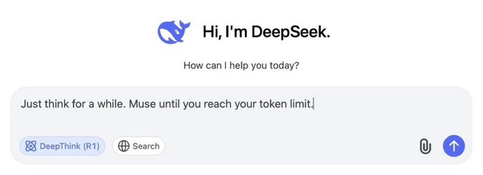

### Hi there 👋

Full-stack developer and a final year CS student at [CUoL](https://www.city.ac.uk/) based in London, UK.

<!--
- 💻 Building full-stack applications with Spring Boot and PostgreSQL
- 📦 Developing an extension of the JJWT library to streamline API authentications
- 🤖 Exploring AI/ML with Python and its applications in the financial sector

-->

<!-- ## 💻 Tech Stack -->
<!-- https://github.com/inttter/md-badges -->
<!-- https://github.com/tandpfun/skill-icons -->
<!-- FORK: https://github.com/LelouchFR/skill-icons -->
<!-- https://github.com/Trixzyy/skill-icons-builder -->

#### Tech Stack

<!--#### Languages-->

<!--#### Frameworks-->

<!--#### Tools-->

#### Connect with me

&nbsp;&nbsp;
&nbsp;&nbsp;
&nbsp;&nbsp;
&nbsp;&nbsp;

<!-- Check out my <a href="https://www.hstoklosa.dev/">portfolio</a> website! -->

<!-- &nbsp;&nbsp;
&nbsp;&nbsp;
&nbsp;&nbsp;
&nbsp;&nbsp;
 -->

<!-- &nbsp;
&nbsp;
&nbsp;
&nbsp;
 -->
